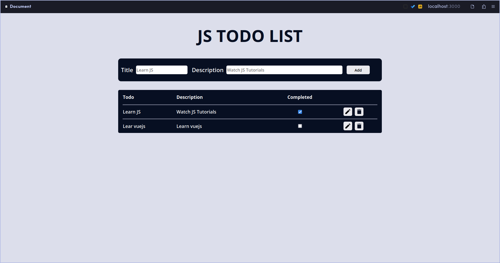

Welcome to my task list app! This is a project I created to learn the basics of JavaScript. With this app, you can easily add, delete, and mark tasks as completed. It's a great way to stay organized and keep track of your daily tasks.
To get started, simply add a task to the list and hit enter. 
You can mark a task as completed by clicking the checkbox next to it,
and delete a task by clicking the delete button. The app is simple and easy to use,
perfect for anyone who wants to learn JavaScript and improve their productivity at the same time.
I hope you enjoy using this app as much as I enjoyed creating it. 
If you have any feedback or suggestions, feel free to reach out to me. Happy tasking!
# TodoApp.github.io

